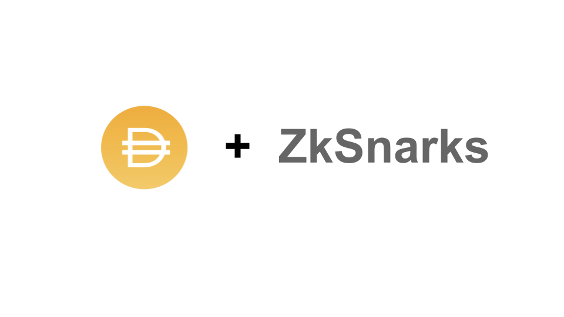

# TrustlessDAI

TrustlessDai is a private DAI transactions on Ethereum using Zk-SNARKs.

Platform try to covers the mainly two points for using private dai transaction,  
1). Make wallet agnostic solutions.  
2). We prioritize submissions that reduce onboarding friction and are usable to people unfamiliar with crypto.

We have created a wallet-dapp which will be used as a crypto wallet and even platform abstract the zero-knowledge concept so unfamiliar crypto people can easily interact with tokens and can make private transaction.

### Video Demo

https://youtu.be/4xTH2C87XVM
[](https://youtu.be/4xTH2C87XVM "Privacy In Payments")

### Modules

1). Automated zero knowledge proof verifier.
- Platform used zokrates library using inside docker container. We have written all zokrates commnd inside the `Dockerfile`.  
- We have written deploy shell script file to run docker for compute witness and generate proof for witness.  
- To automate this all process we wrap up it with nodeJs api. And before each claimDai transaction, platform will call this api to generate the proof and `proof will pass to the smart contract it will verify on-chain.`


2).Smart contract
- Smart contract level when sender transfer DAI. smart contract will create `note` for that transaction of recipient and note will save on-chain.
- when recipient liquidate or claim dai at that time note will verifiy with proof(generated by Automated zero knowledge module).

3). Wallet agnostic solution
- We developed dapp to give wallet agnostic solution. 
- Use,
    - You can transfer DAI privately to any ethereum address.
    - You can accept DAI which is send by other etherum address privately by claimDAI features.  
- Used don't need to worry about the verify proof or compute witness. Platform will handle itself during transaction:)

### Code-structure

[Smart contract](https://github.com/sunnyRK/TrustlessDai/tree/master/contracts)  
[Landing page-Wallet](https://github.com/sunnyRK/TrustlessDai/tree/master/src/components)  
[Generate proof or Automated zero knowledge proof verifier engine](https://github.com/sunnyRK/TrustlessDai/tree/master/zk-node-api)  
[GetWitness Code](https://github.com/sunnyRK/TrustlessDai/tree/master/functions)  
[ContractInstances and Project config](https://github.com/sunnyRK/TrustlessDai/tree/master/config)  

### How to use for devs?

```note:  You must have Linux system to setup```
- Run Dapp on localhost  
1). clone repo `https://github.com/sunnyRK/TrustlessDai`  
2). `cd TrustlessDai`  
3). Install dependencies for dapp `npm install`   
4).Run Dapp `node server.js`  
5). Go to `http://localhost:3000`    

- Run Zokrates on node js server  
1). `Same repo`  
2). `cd TrustlessDai/zk-node-api`  
3). `node index.js`   
    - It will run on `3001 PORT`.

### Contacts

`radadiyasunny970@gmail.com`  
[Twitter](https://twitter.com//RadadiyaSunny)


